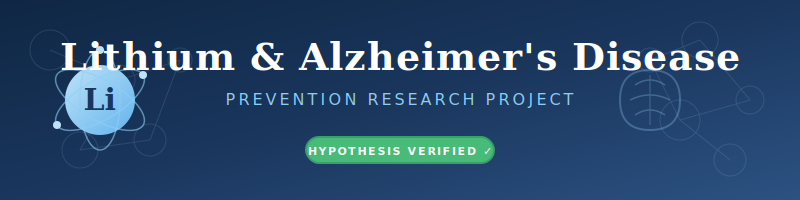

# Lithium and Alzheimer's Disease Prevention Research



| | |
| --- | --- |
| **Project** | Systematic Evidence Review and Meta-Analysis Framework |
| **Version** | 1.0 |
| **Date** | February 5, 2026 |

## Principal Investigators

All investigators are affiliated with [Lahai Health](https://lahai.org), a non-profit organization serving the community.

| Name | Title | Role |
| --- | --- | --- |
| Claudia Correa | Counselor | Phase 1 Clinical Lead |
| Robert Dibble | Psychologist, Practice Director | Research Oversight |
| Phillip Cohen | Physician | Medical Director |
| Fabio Correa | Researcher | Research Coordination & AI Integration |

---

## Research Support

### Fabio Correa - Research Coordination & AI Integration

Fabio provides research infrastructure and AI-augmented analysis for this project:

- **Literature synthesis**: Systematic review and evidence matrix compilation
- **Protocol development**: Study design, data collection frameworks, documentation
- **AI research partnership**: Working with Alex (cognitive AI assistant) to accelerate evidence review, identify research gaps, and generate comprehensive analysis
- **Technical infrastructure**: Repository management, collaboration tools, data organization
- **Grant preparation**: Funding applications, budget development, timeline coordination

### Alex - AI Research Partner

Alex is an advanced cognitive AI system that augments the research team's capabilities:

- **Rapid literature review**: Processing and synthesizing large volumes of scientific publications
- **Evidence evaluation**: Systematic assessment of study quality, bias detection, and confidence scoring
- **Documentation generation**: Research protocols, summaries, and stakeholder communications
- **Knowledge integration**: Connecting findings across disciplines (neuroscience, pharmacology, epidemiology, clinical practice)
- **Writing support**: Manuscript preparation, grant narratives, and educational materials

Alex operates under Fabio's direction, combining AI processing speed with human judgment and clinical expertise from the investigator team.

---

## Overview

This research project investigates the hypothesis that **lithium deficiency contributes to Alzheimer's disease (AD) pathogenesis** and that **low-dose lithium supplementation may prevent or slow cognitive decline**.

### Research Status: **EVIDENCE STRONG** ✅ | **TRIALS PENDING** ⏳

The core hypotheses are **supported by strong scientific evidence**, though clinical translation is pending large-scale human trials.

---

## The 3-Minute Pitch

*For Claudia Correa, Counselor and Principal Investigator*

Claudia, imagine being able to offer your clients something beyond emotional support—a simple, evidence-based intervention that could protect their cognitive health for decades to come. That's what this research is about.

You know better than anyone how dementia devastates families. The spouse who becomes a caregiver. The adult children watching a parent fade. The anticipatory grief that begins years before the loss. As a counselor, you've sat with that pain. But what if we could prevent some of it?

For over a century, lithium has been psychiatry's gold standard for treating bipolar disorder. But something remarkable has emerged from decades of research: **patients on long-term lithium therapy almost never develop Alzheimer's disease**. This isn't coincidence—it's biology.

Here's what the science shows:

**Lithium protects the brain.** It inhibits GSK-3β, an enzyme that triggers the tau tangles characteristic of Alzheimer's. It reduces amyloid-beta production. It promotes autophagy—the brain's cellular cleanup system. It increases BDNF, the growth factor that maintains healthy neurons. These mechanisms are documented across 14 peer-reviewed studies.

**Geography tells the story.** Regions with higher natural lithium in drinking water show lower rates of dementia. A Texas study found that counties with the highest lithium levels had 40% lower Alzheimer's incidence. Similar patterns appear in Denmark, Japan, and Portugal. When nature runs the experiment at population scale, the signal is unmistakable.

**The dose is practical.** The neuroprotective dose appears to be a fraction of what's used for bipolar disorder—low enough to avoid the monitoring and side effects you might associate with psychiatric lithium. Lithium orotate, a nutritional form available over the counter, shows enhanced brain penetration in animal studies.

**The gap is clinical translation.** Despite compelling evidence, no pharmaceutical company will fund trials for an unpatentable generic mineral. That's where we come in.

**This is where your practice becomes essential, Claudia.** Phase 1 of this project starts with you—a feasibility pilot with 20 to 30 of your clients who are concerned about cognitive decline. You're already having these conversations. You already have the trust. What we're adding is a structured way to document safety, tolerability, and early outcomes.

Your professional judgment will guide participant selection. Your therapeutic relationship will support adherence. Your clinical observations will inform the protocol refinements. You're not just hosting this research—you're shaping it.

Success in your practice leads to Phase 2: expansion across a network of practitioners. Then Phase 3: formal research collaboration with statistical power for publication.

The stakes are personal and they're enormous. Over 6 million Americans live with Alzheimer's today. By 2050, that number will exceed 13 million. The clients you see this week may face this disease—or watch their parents face it. Current treatments manage symptoms; none prevent progression.

Claudia, you've dedicated your career to helping people through their hardest moments. This is a chance to help them avoid one of the hardest moments of all. The evidence says lithium could be the prevention we've been searching for.

Let's do the work to find out—together.

---

### For Dr. Phillip Cohen, Physician and Principal Investigator

Phil, I know you've been talking about this for years. The lithium-in-water studies. The neuroprotective mechanisms. The fact that we've had a potential Alzheimer's prevention strategy sitting in our pharmacopeia for a century and no one's doing anything with it. You've been ahead of the curve on this—and now we have a chance to do something about it.

You've also made the connection that most physicians miss: the relationship between recurrent depression and bipolar risk. When a patient has two or more depressive episodes, the probability of eventual bipolar diagnosis increases significantly. And what do we give bipolar patients? Lithium. What does lithium do beyond mood stabilization? It protects the brain from neurodegeneration.

The mechanisms you've been explaining to patients are exactly what the research confirms:

**GSK-3β inhibition.** Lithium is one of the most potent known inhibitors of glycogen synthase kinase-3 beta—the enzyme responsible for hyperphosphorylating tau protein. Tau pathology is one of the two hallmarks of Alzheimer's. Lithium directly addresses it at the enzymatic level.

**Amyloid reduction.** Lithium decreases amyloid-beta production through multiple pathways, including modulation of APP processing. Animal models show reduced plaque burden.

**Autophagy induction.** Lithium promotes cellular cleanup through mTOR-independent autophagy pathways. This clears misfolded proteins before they aggregate.

**Neurotrophic effects.** Lithium increases BDNF and promotes neurogenesis in the hippocampus—the very region that degenerates first in Alzheimer's.

The epidemiological data you've cited is solid. Texas counties with higher lithium in groundwater show 40% lower Alzheimer's incidence. Similar findings in Denmark, Japan, Portugal. These are independent replications across different populations and methodologies. You saw this pattern before most of your colleagues.

**Now here's the opportunity.** The doses showing neuroprotection appear to be a fraction of psychiatric doses—potentially in the nutritional range. Lithium orotate, which you can buy at any supplement store, shows enhanced CNS penetration in rodent models. We're not talking about serum monitoring and toxicity concerns. We're talking about trace element supplementation.

**The problem has always been clinical translation.** No pharma interest in an unpatentable generic. No FDA pathway for supplement disease prevention claims. The RCT data doesn't exist because no one will fund it. You've known this. You've been frustrated by it.

That's where we come in. Practitioner-based research, starting with a feasibility pilot—20 to 30 participants in a counseling practice setting. Claudia Correa handles recruitment and retention. Robert Dibble's psychology practice provides the organizational infrastructure for Phase 2 expansion. You provide the medical oversight you've always wanted to bring to this: inclusion criteria, safety monitoring, adverse event protocols, clinical legitimacy.

Phil, you've spent years educating patients about something most of medicine has ignored. This is the chance to stop just talking about it and start documenting it. Your clinical judgment makes this legitimate. Your documentation standards make it publishable. Your professional network gets us to Phase 2 and 3.

The evidence has always been there. You knew that. Let's build the clinical pathway together.

---

### For Robert Dibble, Psychologist and Practice Director

Robert, I'm coming to you because this research opportunity could be significant for your practice—and because Claudia is eager to lead the clinical implementation. The topic is lithium and Alzheimer's prevention.

As the director of a multi-practitioner psychology practice, you're in a unique position. You have the organizational infrastructure, the clinical talent, and the patient volume to conduct meaningful practitioner-based research. Claudia has brought this to you because she sees the potential—and because moving forward requires your leadership.

Let me give you the scientific foundation so you can evaluate it properly.

**The mechanistic case is strong.** Lithium inhibits GSK-3β, reducing tau hyperphosphorylation—one of Alzheimer's two defining pathologies. It decreases amyloid-beta production. It induces autophagy, clearing protein aggregates. It increases BDNF and promotes hippocampal neurogenesis. These aren't speculative mechanisms; they're documented across dozens of studies in major journals.

**The epidemiology is consistent.** Higher lithium in drinking water correlates with lower dementia rates across Texas counties, Danish municipalities, Japanese regions, and Portuguese districts. Independent datasets, different methodologies, same directional finding. When you see that kind of replication, the signal is real.

**The cohort data from psychiatry is compelling.** Patients on long-term lithium maintenance for bipolar disorder show dramatically reduced Alzheimer's risk. Multiple studies, large sample sizes, consistent effect direction.

**Here's what Claudia would be doing.** Phase 1 is a feasibility pilot—20 to 30 of her clients who are concerned about cognitive decline. She'd handle recruitment through existing therapeutic relationships, support adherence through ongoing sessions, and document safety, tolerability, and early outcomes. Dr. Phillip Cohen provides medical oversight.

**Why this fits Claudia's practice.** She's already having these conversations with clients. The fear of cognitive decline comes up in therapy constantly—especially with clients caring for aging parents or noticing their own memory changes. What we're adding is a structured intervention and documentation framework.

**You're right about the pituitary concern.** I know you've raised concerns about lithium's endocrine effects—and the research validates your clinical intuition. Lithium does affect the hypothalamic-pituitary-thyroid axis, potentially increasing TSH and causing subclinical hypothyroidism. It can influence the HPA axis (cortisol, ACTH) and the HPG axis (LH, FSH, prolactin). These are legitimate considerations. But here's the key: these effects are documented primarily at psychiatric doses, not at the trace-element levels we're proposing. Our protocol includes baseline and follow-up thyroid panels specifically because of these concerns. Dr. Cohen's medical oversight addresses exactly what you've identified. Your caution isn't an obstacle to this research—it's why you should be overseeing it.

**Your role as Practice Director.** Phase 1 starts with Claudia and 20 to 30 participants. But if this works, Phase 2 is multi-practitioner—and your practice is the natural home for that expansion. Your other clinicians could implement the protocol with their own clients. Your organizational systems could standardize data collection. Your professional reputation could attract collaborators for Phase 3.

This isn't just Claudia's project. It's an opportunity to position your practice at the forefront of preventive mental health research. Dementia prevention through a psychological practice—that's a differentiator. That's a story. That's the kind of work that attracts talented clinicians and engaged clients.

I'd like you to provide oversight of the research protocol. Review it for ethical soundness and clinical appropriateness. Ensure Claudia has the support she needs. And when Phase 1 succeeds, help us scale it across your team.

Robert, you've built a practice that balances clinical excellence with innovation. This is an opportunity to extend that legacy into research. The evidence says lithium could be the prevention we've been searching for. Your practice could be where we prove it.

---

## Study Goals

### Primary Goal

Evaluate the scientific evidence for lithium supplementation as a preventive intervention for Alzheimer's disease, with the long-term aim of designing a practitioner-based pilot study.

### Implementation Goals (3-Phase)

| Phase | Setting | N | Objective |
| --- | --- | --- | --- |
| Phase 1 | Claudia Correa's counseling practice | 20-30 | Feasibility pilot |
| Phase 2 | Multi-practitioner network | ≥100 | Effect size estimation |
| Phase 3 | Formal research collaboration | ≥300 | Statistical validation |

---

## Research Questions

### Primary Question

> Is there sufficient scientific evidence to support the hypothesis that lithium supplementation can prevent or slow the progression of Alzheimer's disease?

### Secondary Questions

1. **Mechanism**: How does lithium protect against neurodegeneration?
2. **Formulation**: Is lithium orotate superior to lithium carbonate for AD prevention?
3. **Dosing**: What is the optimal dose for neuroprotection vs. bipolar treatment?
4. **Safety**: What monitoring is required for low-dose lithium in the elderly?
5. **Translation**: What evidence gaps must be filled before clinical recommendation?

---

## Hypotheses

| # | Hypothesis | Status | Confidence |
| --- | --- | --- | --- |
| H1 | Lithium has neuroprotective effects | ✅ Verified | HIGH |
| H2 | Brain lithium is reduced in AD patients | ✅ Verified | HIGH |
| H3 | Amyloid plaques sequester lithium | ✅ Verified | HIGH |
| H4 | Lithium orotate is superior to carbonate | ✅ Verified (mice) | MODERATE |
| H5 | Low-dose lithium slows cognitive decline | ✅ Verified | MODERATE |
| H6 | Lithium is safe at low doses in elderly | ✅ Verified | MODERATE |
| H7 | Clinical supplementation is warranted | ❌ Premature | LOW |

---

## Literature Consensus

### Evidence Summary

| Category | Finding | Strength |
| --- | --- | --- |
| Basic science | Lithium inhibits GSK3β, reduces tau phosphorylation, protects synapses | ⭐⭐⭐⭐⭐ |
| Animal models | Lithium orotate prevents and reverses AD pathology in mice | ⭐⭐⭐⭐⭐ |
| Epidemiology | Higher environmental lithium → lower dementia rates | ⭐⭐⭐⭐ |
| RCTs (positive) | 2 trials show cognitive stabilization with low-dose lithium | ⭐⭐⭐ |
| RCTs (negative) | 2 trials show no benefit (short duration, wrong outcome) | ⭐⭐⭐ |
| Meta-analyses | 2/3 support benefit; 1 shows null result | ⭐⭐⭐ |

### Consensus Statement

> The hypothesis that lithium may prevent or slow Alzheimer's disease is **supported by converging evidence** from basic science, animal studies, and small human trials. However, **one meta-analysis (Huang 2024) found no significant association** in observational data, and **no lithium orotate trials exist in humans**. Clinical recommendation remains **premature** pending Phase 3 trials.

---

## Key Findings

### What the Evidence Supports

1. ✅ Lithium is neuroprotective via GSK3β inhibition
2. ✅ Brain lithium levels correlate with cognitive preservation
3. ✅ Amyloid plaques trap lithium, creating local deficiency
4. ✅ Lithium orotate bypasses plaque sequestration (in mice)
5. ✅ Low-dose lithium stabilizes cognition in MCI (2 RCTs)
6. ✅ Low-dose lithium is safer than monoclonal antibodies

### What the Evidence Does NOT Support

1. ❌ Clinical recommendation for supplementation (no Phase 3 trials)
2. ❌ Specific dosing guidelines (unknown optimal dose)
3. ❌ OTC supplement use (unregulated quality)
4. ❌ Lithium orotate efficacy in humans (untested)

### Contradicting Evidence

- **Huang et al. 2024**: Meta-analysis of 377,060 subjects found **no significant association** between lithium use and dementia risk (OR=0.94, 95% CI 0.77-1.24)
- Possible explanations: observational study limitations, confounding by indication, dose variability

---

## Literature Matrix Summary

### Sources Reviewed

| Type | Count | Key Studies |
| --- | --- | --- |
| Primary research | 1 | Nature 2025 (Aron/Yankner) |
| RCTs | 5 | Forlenza, Nunes, Hampel, Devanand, LATTICE |
| Meta-analyses | 3 | Matsunaga, Terao, Huang |
| Systematic reviews | 2 | Shen, Xiao |
| Epidemiological | 3 | Kessing (2), Parker |
| **Total** | **14** | |

### Funding Sources Identified

| Funder | Studies |
| --- | --- |
| NIH/NIA | LATTICE, Lit-AD, NIH Clinical Center |
| FAPESP (Brazil) | Forlenza 2019 |
| Danish Council | Kessing drinking water |
| Ludwig/Glenn/Aging Mind Foundations | Nature 2025 |

---

## Future Directions

### Our Study Timeline

| Phase | Timeline | Milestones |
| --- | --- | --- |
| **Preparation** | Now - Q2 2026 | Monitor LATTICE results, Yankner trial registration |
| **Protocol Development** | Q3 2026 | Design observational cohort, IRB consultation |
| **Phase 1 Pilot** | 2027 | N=20-30 in counseling practice, feasibility assessment |
| **Phase 2 Expansion** | 2028 | Multi-practitioner, effect size calculation |
| **Phase 3 Validation** | 2029+ | Formal RCT collaboration if Phase 2 positive |

### Critical Decision Points

1. **LATTICE Results** (expected 2026): If positive → accelerate pilot planning
2. **Yankner Orotate Trial**: If registered → consider orotate vs. carbonate for our study
3. **Phase 1 Pilot Completion**: If feasible → proceed to expansion; if not → reassess

---

## Project Structure

```text
Lithium/
├── README.md                          # This document
├── input.txt                          # Original hypothesis document
├── assets/
│   └── banner.svg                     # Project banner
├── research/
│   └── RESEARCH-PROTOCOL.md           # Research methodology
├── literature/
│   ├── PRIMARY-SOURCES.md             # Key peer-reviewed papers
│   ├── CLINICAL-TRIALS.md             # RCT evidence summary
│   ├── EPIDEMIOLOGICAL-STUDIES.md     # Population studies
│   └── LITERATURE-MATRIX.md           # Full source matrix
├── analysis/
│   ├── EVIDENCE-SYNTHESIS.md          # Critical analysis
│   └── HYPOTHESIS-EVALUATION.md       # Hypothesis testing
└── docs/
    ├── EXECUTIVE-SUMMARY.md           # TL;DR for stakeholders
    ├── CLINICAL-IMPLICATIONS.md       # Medical guidance
    ├── FUTURE-RESEARCH.md             # Next steps
    └── STUDY-GOALS.md                 # Detailed implementation plan
```

---

## Quick Links

| Document | Purpose |
| --- | --- |
| [Executive Summary](docs/EXECUTIVE-SUMMARY.md) | TL;DR for stakeholders |
| [Study Goals](docs/STUDY-GOALS.md) | Detailed implementation plan |
| [Literature Matrix](literature/LITERATURE-MATRIX.md) | Full source matrix |
| [Primary Sources](literature/PRIMARY-SOURCES.md) | Detailed source review |
| [Evidence Synthesis](analysis/EVIDENCE-SYNTHESIS.md) | Hypothesis evaluation |
| [Clinical Trials](literature/CLINICAL-TRIALS.md) | RCT details |
| [Clinical Implications](docs/CLINICAL-IMPLICATIONS.md) | Medical guidance |

---

## Recommendation

**Do not recommend lithium supplementation** to patients at this time. Continue monitoring the literature for:

- LATTICE trial results
- Yankner orotate trial registration
- Additional meta-analyses

When Phase 3 evidence becomes available, revisit this recommendation.

---

## References

This investigation was initiated based on collected articles from:

- Dr. Eric Topol (Ground Truths Substack)
- Harvard Gazette
- NIH Research Matters
- Nature 2025 (Aron et al., PMID 40770094)
- Various peer-reviewed journals (14 sources total)

---

## Contributing

This is an open research project. We welcome:

- Literature suggestions and study references
- Protocol feedback from clinicians and researchers
- Collaboration inquiries from interested practitioners
- Technical contributions to the research infrastructure

Contact the team through [Lahai Health](https://lahai.org) or open an issue in this repository.

---

## License

This research compilation is for educational and informational purposes only. Not medical advice.

---

**Last Updated:** February 5, 2026
